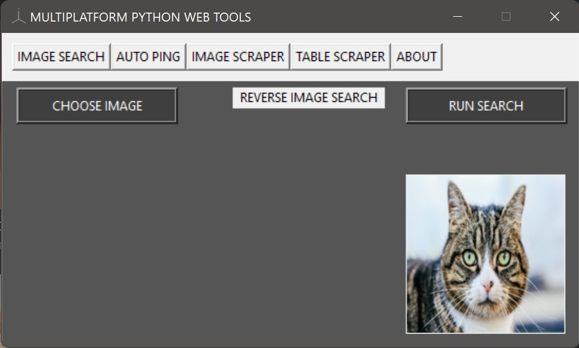
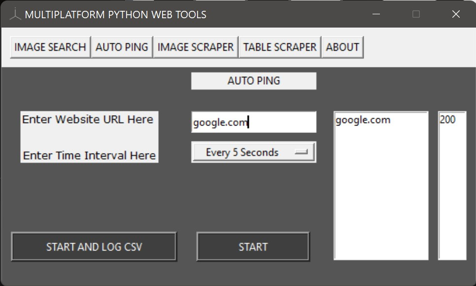
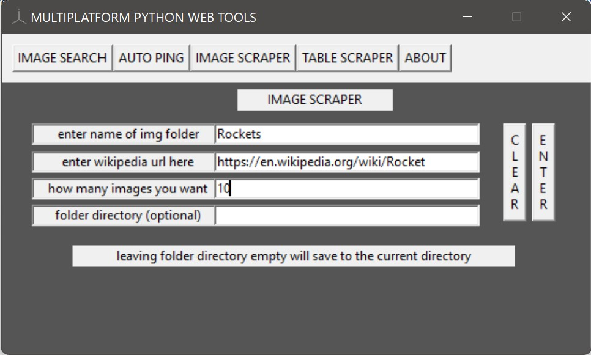
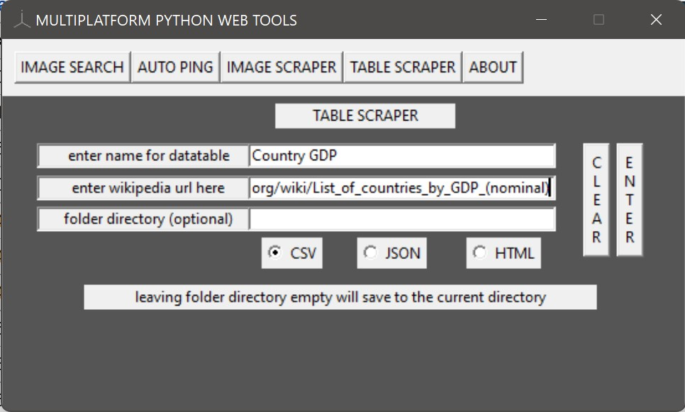

A simple Python desktop application compatible for Windows and Linux, designed with tKinter and programmed with 4 tools for web search automation, web data extraction, and datasheet logging.

<b>Includes:</b> 
Reverse Image tool\
Multithreaded Website Auto Pinger\
Website Image Scraper\
Website Table Scraper\
About Page

<b>HOW TO RUN</b> 
Simply clone the repository and click on main.py.

<b>REVERSE IMAGE</b> 

This tool allows you to select any image (.jpg or .png) from your computer, and will show a thumbnail of it on the bottom right (a cat is shown in the example image), and clicking Run Search will initiate the chrome web drive executable, running the reverse image search and giving you the most relevant images it can find.
  
 
<b>AUTO PING</b> 

This tool allows you to enter a website (google.com in the example) and setting a ping interval from once every 5 seconds to once every 30 minutes, and a seperate thread will initate which will handle the pinging. A dropdown list on the right will show what websites are currently being pinged and the dropdown list next to it shows the returned status code (200 in the example which indicates a good connection).

<b>AUTO PING</b> 

This tool allows you to enter a name for a folder where all the scraped images will go, a wikipedia URL, how many images you want, and if you want the folder to be sent to a specific directory (the example shows a folder named Rocket, a wikipedia article for rockets, 10 images, and that the folder will go to the folder where main.py is.)

<b>AUTO PING</b> 

This tool is similar to the image scraper, except that you input a wikipedia url which contains a table, and it will return that table inside a CSV, JSON or HTML file (the example uses Country GDP as the file name, and the url of the wikipedia article for country GDP).
